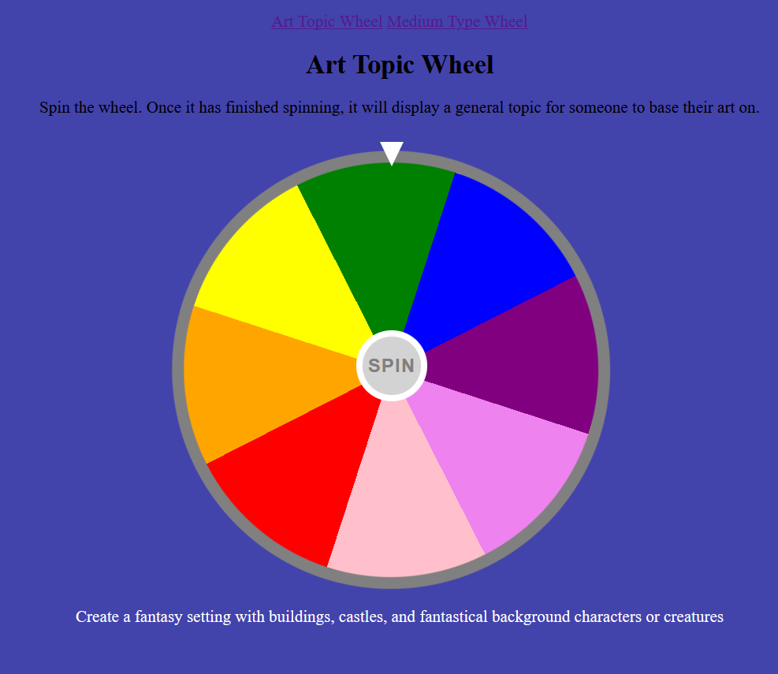
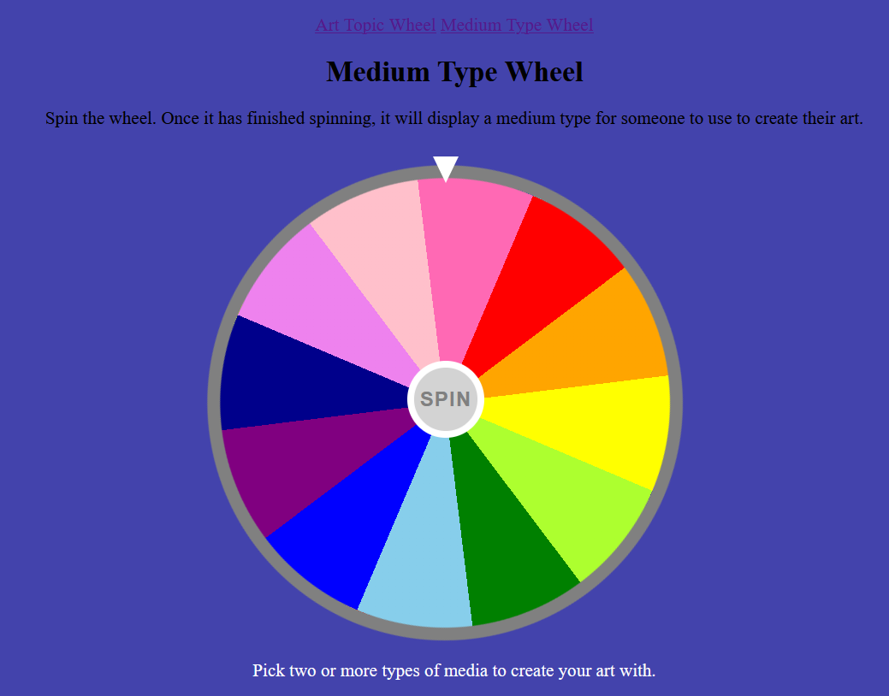

# Topic and Medium Generator Website for Artists

## What the Website Does
My website have two function.
1. Spin a topic wheel. The wheel has 8 topics on it. This wheel gives the artist a topic for their art.
2. Spin a medium wheel that has 12 mediums on it. This wheel gives the artist a medium for the artist to use for their art.

## Images



## How it Works
It was made using 2 html files(index.html, medium.html) for the two webpages. These two pages allow movement between each other using a navigation bar at the top of the page. 
There are two style.css files that create the seperated wheels with 8 slices in style1 and 12 slices in style 2. 
Finally, there are two js files(script1.js, script2.js) that add functionality to each webpage. They allow the wheels to spin and they show the viewer/artist what topic or medium they spun.

## How to Install It
This is a static website 

```bash
git clone https://github.com/Dragoman23/Art-Idea-Website.git
cd Art-Idea-Website
```

 `index.html` links to `medium.html` via a relative path. Therefore, do either of the following:

- **VS Code Live Server:** right-click `index.html` → "Open with Live Server"
- **Python:** `python3 -m http.server 8000`, then visit `http://localhost:8000`

Start from `index.html` — it links to `medium.html` using the navigation bar at the top.

## How to Use It

## How to Use It
To use the website, just click on the website linked in the top right corner of this repository. The Website is hosted on vercel allowing for a website that anyone can use.
Link: https://art-idea-spinner-website.vercel.app/


